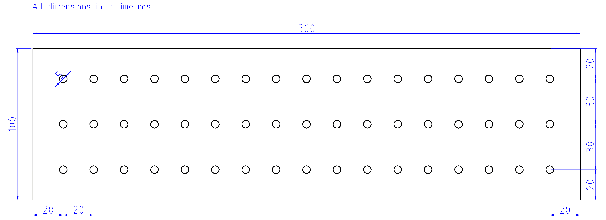
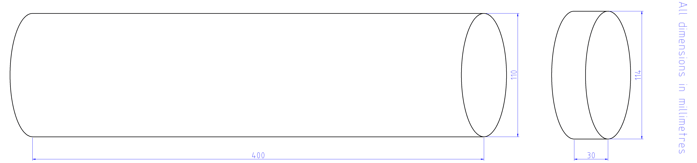
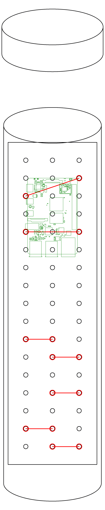
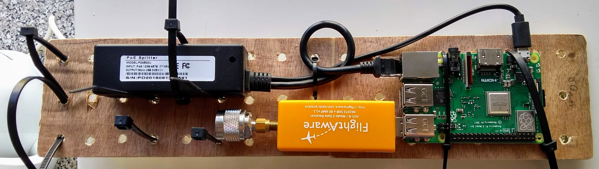
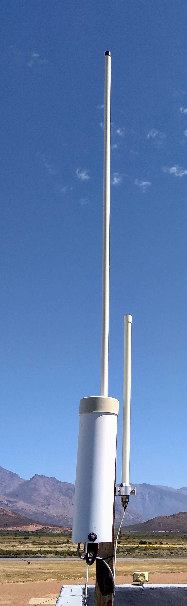

## Open Glider Network receiver station

This project shows a concrete implementation of the ideas and goals on the 
Open Glider Network wiki page discussing how to build an 
[OGN receiver](http://wiki.glidernet.org/ogn-receiver-hardware-and-software#hardware).

Below is my current reference design which incorporates the learnings of more than 12 receiver-years
worth of experience.
The receivers are located outdoors in the moderately harsh environment of the Western Cape,
South Africa.

### Hardware

The CAD file for the below diagrams are in their respective directories.

All dimensions are in millimetres.

#### Bill of Materials

Item   | Description
---: | :---
Raspberry Pi | Version 3B, 3B+, or 4
FlightAware USB	| with built-in LNA, but not the one with the 1090 MHz filter
8 GB SD card |or greater
backplane | See description below
outdoor enclosure | See description below
PoE splitter | Active, standards compliant (IEEE 802.3af)
Antenna-to-SDR adaptor | Male N-type to male SMA adaptor
Antenna | 868 Mhz depending on your location. Available online from China.
PoE injector | Active, standards compliant (IEEE 802.3af)
Ethernet cable | Outdoor rating
cable/zip-ties | width less than 5 mm

#### Backplane

##### Material: ~3 mm plywood

The backplane is used to mount the Raspberry Pi and other components, mainly for strain relief, and durability.
One may be tempted to drill only those holes that are immediately required, by in my experience, a configurable
backplane, decoupled from the immediate components is a better idea.  For example, the Raspberry Pi 4 upgrade 
swapped the USB / Ethernet positions, implying that [only] the lower holes now need to be mirror imaged.

#### Weather-proof Outdoor Enclosure

##### Material: white, 110 mm PVC pipe, and matching COTS fittings.

#### Assembly

Parts not shown in CAD drawing:

* PoE splitter, with 5V USB power output (RPi4 requires Type-C plug, the rest, micro-USB)
* Ethernet cable
* FlightAware USB RTL SDR
* Male N-type to male SMA connector (one piece, not a pig-tail)
* Antenna cable

##### Receiver's Internal Components

##### Receiver's Mounted

