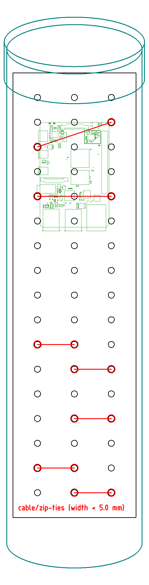

# ogn-hardware
Open Glider Network receiver station hardware

	antenna	OGN_Rx	2	2			868 Mhz "Chinese"	Connector: N-type female
	adaptor						Aerial to LNA / SDR	Male N-type to male SMA
	LNA						LNA: ZX60-112LN+	2 × SMA-female
	cable assy						>10 meters of outdoor coax	SMA-male to SMA-male.  ¿RG58 / RG59?
	SDR						Generic	Generic, "TV-aerial-female"
	SoC						Raspberry Pi 3.  Kit?	WiFi, enough power to run ADS-B as well, GPU, 
	SD card						8 GB	10 MB/s minimum
	PSU						2.5A 5V USB	For Raspberry Pi 3 & LNA
	housing						Raspberry Pi 3 Housing	
	cable assy						>3m Ethernet cable	Indoors
	cable	LNA	2	2			LNA power cable	> 10m. twinflex, 7 ohms for 20 m
	connector		2	2			RPI GPIO SIL pin connectors for pin ? & ? 	
	tape		2	2			Butyl / Self-amalagamating tape	19mm x 10M Self Amalgamating Tape  R190 scoop
	outdoor housing		2				Outdoors LNA housing	Enclosure / Pipe , > 35 mm, white
	adhesive standoffs		8

					